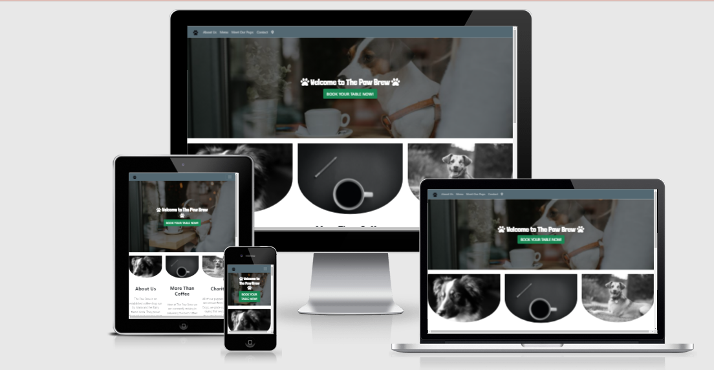

# The Paw Brew

- Live Version: [https://misauraleitao.github.io/thepawbrew/]
- GitHub Repository:[https://github.com/misauraleitao/thepawbrew]

This website is about a dog coffee shop in London. 
In this website you can find information about the establishment of the business, book a table,
see pictures and read each dog's profile as well as the coffee shop's menu.
I have designed this by making sure it is easy to navigate, clear and simple information and at the 
same time looking appealing and captivating to the user.

__UX__

This is a front-end only website. The audience targetted are people that might be interested
in visiting the cafe for the first time and therefore might want to book a table, read the menu 
or could be existing customers too.

__In order to achieve this I have created:__

- About us/Home Page where users can read through information about the business, the products
and where they rescue the dogs from.
- A review carousel so that users can read through and find confidence in the business.
- There is a gallery page called Meet The Pups which hosts pictures and brief profile descriptions
of all the dogs at the cafe.
- By clicking on the location icon on the navbar users can find an embed google maps iframe
with the exact pinpoint of the location of where the cafe is located. 
- If users would wish to make general enquires or request a table I have added a contact page 
where users are asked to fill out a form so that The Paw Brew staff can get in contact with them.
- On the footer section of all webpages users can find social media links, contact number, email and 
address as well as the option to input their email address in order to subscribe to a newsletter aswel as
recieving discounts and updates from The Paw Brew.
- The menu page allows the user to navigate through The Paw Brew's products and in there is also 
information about dietary requirements.

## First User Goals:
- Be able to easily navigate through the website.
- Find clear stated reviews done by people about the quality of the business.
- Find valuable information about the business, products and puppies.
- On the menu I want to make sure there are clear information about dietary needs.
- Booking table is possible or simply to make any existing enquires.
- Clear mapped location of the business.

## Returning visitor Goals:
- I want to make find out about new items in the menu if they are displayed and clearly labelled.
- Book a table options.
- Social Media links. 
- Contact information like phone numbers and emails.

## Frequent User Goals:
- Be able to subscribe to a newsletter that will email me information and updates.
- New puppies at the coffee shop updated pictures and text.
- New items on the menu.

# Design 

## Colours:
Colours used on this website are white, dark slate gray and dark slate green.

## Typography:
I have added Google Fonts "Londrina", and different classes from bootstrap like "lead" to make the website 
look more appealing.

## Imagery:
I have used black and white images and aestheticly pleasing images to give the impression of the rustic look.

# Wireframes
 Here you can see hand designed wireframes by myself, so that I could have an exact idea of what I wanted the website to look like.
 
 

# Features

### Home/About Us Page

- Review Carousel- this is a captivating display which allows the audience to read through
customers views on the establishment.
- Book you table- the button is situated over the hero image so that the user can go straight 
into booking a table if they wish to. This is useful as the user might only be on the webpage 
to book, therefore it gives the user time efficiency.
- Click me link- the link on the Charity section will take the user to the offical Battersea 
Dog and Cat rescue where they can follow instructions on adoption or donation.

### Our Menu 
- Using bootstrap I have muted some text for the vegan options and also added 
badges on NEW products.

### Meet our Pups

- Hover over images- whilst on this page users can find images of the dogs at The Paw Brew.
By hovering through them or, if on mobile, clicking the image it shows the dog's name and breed.

### Contact Us/ Booking Page 

- Form- this feature provides a form so that the user can fill it out so that they can get in contact
with The Paw Brew in regards of making a booking or to simply make an enquire.

_All Pages_

- Social Media Links- it allows the user to connect with The Paw Brew by following them.
- Subscribe- Users can input their email address in order to recieve a newsletter.
- Hero images- This makes the website more eye catching and adds style to it.

# Technologies

- HTML5- used as layout and construction of the website.
- CSS- used to style it.
- Bootstrap v5.0- this was used to create a time efficent and fast layout. Grids, components and other 
documents to improve the overall design of the webpage with less work.
- JavaScript- used on Review Carousel.
- Git- Git was used for version control by using the Gitpod terminal to commit to Git and Push to GitHub.
- GitHub- GitHub was used to store the project's code after being pushed from Git.
- Font Awesome- This was used to add icons to the website.
- Google Fonts- I have used the font "Londrina" from google fonts.

# Testing
I ran this website through theese devices and browsers. During this process I have found no issues at all.
Further testing was done by making sure all links worked correctly and linked properly. Also, I made sure the iframes were 
responsive in every device and browser alongside with the rest of the website.

### Devices Used:
- Iphone X ios - no issues, fully responsive.
- Poco mobile android- no issues, fully responsive.
- HP Laptop windows - no issues, fully responsive.
- Dell Laptop- no issues, fully responsive.
- Am I Responsive website - [http://ami.responsivedesign.is/?url=https%3A%2F%2Fmisauraleitao.github.io%2Fthepawbrew%2Findex.html]

### Browsers Used:
- Chrome- no issues, fully responsive.
- Microsoft Edge- no issues, fully responsive.
- Mozilla Firefox- no issues, fully responsive.
- Safari- no issues, fully responsive.

# Issues/Bugs
No issues/bugs found.

# Validation 
- All files passed validation testing at W3 validator with no errors a few warnings.
- All .html - [https://validator.w3.org/]
- stylesheet.css - [https://jigsaw.w3.org/css-validator/]

# Deployment

My website is deployed on GitHub pages -https://misauraleitao.github.io/thepawbrew/ .
__Steps__

- First step is to log in to Github and locate the remote repository.
- At the top of the repository bar click on Settings
- Once at the settings page you may scroll down to locate Pages section.
- Under Source, click the dropdown menu named as None and select Master Branch instead.
- You will now notice the page refreshes naturally and you now can find your publish link in the Pages section.

# Credits

- Media Content- all images used from various sources online
- Battersea Dogs and Cats for the CLICK ME LINK.
## Code:
- Hero images - [https://www.w3schools.com/howto/howto_css_hero_image.asp]
- Footer - [https://webdesign.tutsplus.com/tutorials/how-to-build-a-responsive-multi-level-sticky-footer-with-flexbox--cms-33341]
- Review Carousel - [https://www.w3schools.com/howto/howto_js_quotes_slideshow.asp]
- Hover over images - [https://www.w3schools.com/howto/howto_css_image_overlay.asp]

# Acknowlegments

- Code Institute
- W3 schools.com- I used enomerous of tutorials on their website to help me with mine. These were 
the review carousel, hero image on home page, styling images and hover over images and also a media queria for the iFrame Google Map.
- Envatotuts+ (anna monus)- I took inspiration and help from her article on building a Responsive, Multi-Level, Sticky Footer With Flexbox.
- Bootstrap v5.0

